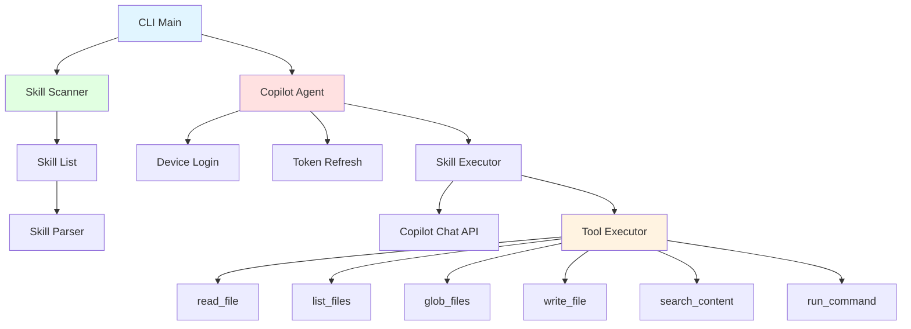

> [!NOTE]
> This README was generated by [SKILL](https://github.com/pardnchiu/skill-readme-generate), get the ZH version from [here](./README.zh.md).

# go-agent-skills

[](https://pkg.go.dev/github.com/pardnchiu/go-agent-skills)
[](https://goreportcard.com/report/github.com/pardnchiu/go-agent-skills)
[](LICENSE)
[](https://github.com/pardnchiu/go-agent-skills/releases)

> A lightweight Go CLI tool that executes AI skills via GitHub Copilot authentication with a complete filesystem toolchain

## Table of Contents

- [Features](#features)
- [Architecture](#architecture)
- [Installation](#installation)
- [Usage](#usage)
- [CLI Reference](#cli-reference)
- [API Reference](#api-reference)
- [License](#license)
- [Author](#author)
- [Stars](#stars)

## Features

- **GitHub Copilot Authentication**: Device code login flow with automatic token refresh mechanism
- **Multi-Directory Skill Scanning**: Automatically scans `.claude/skills`, `.skills`, `.opencode/skills`, `.openai/skills`, `.codex/skills`, and `/mnt/skills/*` for available skills
- **Skill Execution Engine**: Executes skills via Copilot Chat API with up to 128 tool call iterations
- **Complete Tool System**: Built-in `read_file`, `list_files`, `glob_files`, `write_file`, `search_content`, and `run_command` tools
- **Safe Command Execution**: Command whitelist mechanism, `rm` automatically moves to `.Trash` instead of deleting, shell operator support
- **Directory Exclusion**: Automatically excludes `.git`, `node_modules`, `vendor`, `dist`, and other directories
- **Interactive Confirmation**: Prompts user before each tool call, supports `--allow` flag to skip confirmation

### Roadmap

**Authentication:**
- [x] Support GitHub Copilot authentication
- [ ] Support Claude API key authentication
- [ ] Support Claude device authentication
- [ ] Support OpenAI API key authentication
- [ ] Support OpenAI device authentication

## Architecture



## Installation

### Prerequisites

- Go 1.20 or higher
- GitHub Copilot subscription (for authentication)

### Install from Source

```bash
git clone https://github.com/pardnchiu/go-agent-skills.git
cd go-agent-skills
go build -o agent-skills cmd/cli/main.go
```

### Using go install

```bash
go install github.com/pardnchiu/go-agent-skills/cmd/cli@latest
```

## Usage

### First-Time Authentication

On first run, the GitHub Copilot device code login flow triggers automatically:

```bash
./agent-skills
```

The system displays:
1. User Code
2. Verification URI
3. Expiration time

Press Enter to open the browser automatically, then enter the user code to complete authentication. The token is stored at `~/.config/go-agent-skills/copilot_token.json`.

### List All Available Skills

```bash
./agent-skills list
```

Example output:

```
Found 3 skill(s):

• commit-generate
  Generate single-sentence commit message from git diff
  Path: /Users/user/.claude/skills/commit-generate

• readme-generate
  Generate bilingual README from source code analysis
  Path: /Users/user/.claude/skills/readme-generate

• version-generate
  Generate structured changelog and recommend new version from latest git tag to HEAD
  Path: /Users/user/.claude/skills/version-generate
```

### Execute a Skill

```bash
./agent-skills run <skill_name> <input>
```

Example:

```bash
# Interactive mode (confirm before each tool call)
./agent-skills run commit-generate "generate commit message from current changes"

# Auto mode (skip confirmation)
./agent-skills run readme-generate "generate readme" --allow
```

## CLI Reference

| Command | Syntax | Description |
|---------|--------|-------------|
| `list` | `./agent-skills list` | List all installed skills |
| `run` | `./agent-skills run <skill> <input> [--allow]` | Execute the specified skill |

### Flags

| Flag | Description |
|------|-------------|
| `--allow` | Skip interactive confirmation prompts for tool calls |

### Environment Variables

| Variable | Default | Description |
|----------|---------|-------------|
| `HOME` | - | Used to locate token storage path `~/.config/go-agent-skills/` |

### Built-in Tools

| Tool | Parameters | Description |
|------|------------|-------------|
| `read_file` | `path` | Read file content at the specified path |
| `list_files` | `path`, `recursive` | List directory contents with optional recursive mode |
| `glob_files` | `pattern` | Find files matching a glob pattern (e.g., `**/*.go`) |
| `write_file` | `path`, `content` | Write or create a file |
| `search_content` | `pattern`, `file_pattern` | Search file content using regex patterns |
| `run_command` | `command` | Execute whitelisted shell commands |

### Allowed Commands

| Category | Commands |
|----------|----------|
| Version Control | `git` |
| Languages & Package Managers | `go`, `node`, `npm`, `yarn`, `pnpm`, `python`, `python3`, `pip`, `pip3` |
| File Operations | `ls`, `cat`, `head`, `tail`, `pwd`, `mkdir`, `touch`, `cp`, `mv`, `rm`* |
| Text Processing | `grep`, `sed`, `awk`, `sort`, `uniq`, `diff`, `cut`, `tr`, `wc` |
| Search | `find` |
| Data Format | `jq` |
| System Info | `echo`, `which`, `date` |

> \* The `rm` command automatically moves files to a `.Trash` directory instead of permanently deleting them

## API Reference

### Client Package (`internal/client`)

#### `NewCopilot() (*CopilotAgent, error)`

Create a new Copilot client instance. Automatically loads the stored token, or triggers the device code login flow if none exists.

#### `(*CopilotAgent) Execute(ctx context.Context, skill *skill.Skill, userInput string, output io.Writer, allowAll bool) error`

Execute the specified skill. Enters a tool call loop (up to 128 iterations), processing tool call requests from the API response in each iteration.

**Parameters:**
- `ctx`: Context instance
- `skill`: Skill instance to execute
- `userInput`: User input command or prompt
- `output`: Output writer (typically `os.Stdout`)
- `allowAll`: Set to `true` to skip tool call confirmation prompts

#### `(*CopilotAgent) Login(ctx context.Context) (*CopilotToken, error)`

Perform the GitHub Copilot device code login flow. Displays the verification URI and user code, opens the browser automatically, and polls until the user completes authorization or the device code expires.

### Skill Package (`internal/skill`)

#### `NewScanner() *Scanner`

Create a new skill scanner instance and immediately perform scanning. Scans all configured paths concurrently using goroutines.

#### `(*Scanner) List() []string`

Get a list of all scanned skill names.

### Tools Package (`internal/tools`)

#### `NewExecutor(workPath string) (*Executor, error)`

Create a new tool executor. Loads tool definitions from embedded `tools.json`, initializes the command whitelist and directory exclusion list.

#### `(*Executor) Execute(name string, args json.RawMessage) (string, error)`

Dispatch execution to the corresponding tool function by name.

**Supported tools:** `read_file`, `list_files`, `glob_files`, `write_file`, `search_content`, `run_command`

### Data Structures

#### `CopilotToken`

```go
type CopilotToken struct {
    AccessToken string    `json:"access_token"`
    TokenType   string    `json:"token_type"`
    Scope       string    `json:"scope"`
    ExpiresAt   time.Time `json:"expires_at"`
}
```

#### `Skill`

```go
type Skill struct {
    Name        string // Skill name
    Description string // Skill description (parsed from SKILL.md frontmatter)
    AbsPath     string // Absolute path
    Path        string // Skill folder path
    Content     string // Full file content
    Body        string // Body content after frontmatter
    Hash        string // SHA-256 content hash
}
```

#### `SkillList`

```go
type SkillList struct {
    ByName map[string]*Skill // Skills indexed by name
    ByPath map[string]*Skill // Skills indexed by path
    Paths  []string          // List of scanned paths
}
```

#### `Executor`

```go
type Executor struct {
    WorkPath       string          // Working directory
    Allowed        []string        // Allowed folders for operations
    AllowedCommand map[string]bool // Command whitelist
    Exclude        []string        // Excluded directory names
    Tools          []Tool          // Tool definitions
}
```

#### `Tool`

```go
type Tool struct {
    Type     string       `json:"type"`
    Function ToolFunction `json:"function"`
}

type ToolFunction struct {
    Name        string          `json:"name"`
    Description string          `json:"description"`
    Parameters  json.RawMessage `json:"parameters"`
}
```

## License

This project is licensed under the [MIT LICENSE](LICENSE).

## Author


<h4 style="padding-top: 0">邱敬幃 Pardn Chiu</h4>

<a href="mailto:dev@pardn.io" target="_blank">

</a> <a href="https://linkedin.com/in/pardnchiu" target="_blank">

</a>

## Stars

[](https://www.star-history.com/#pardnchiu/go-agent-skills&Date)

***

©️ 2026 [邱敬幃 Pardn Chiu](https://linkedin.com/in/pardnchiu)
