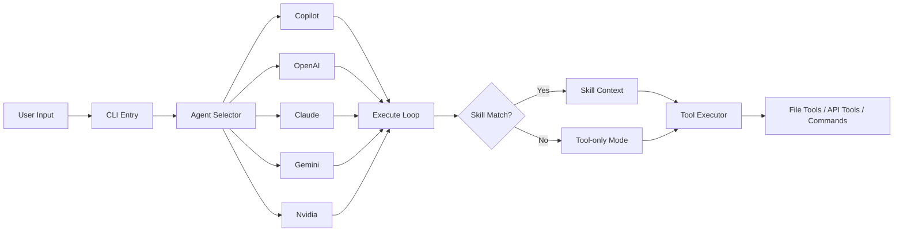

> [!NOTE]
> This README was generated by [SKILL](https://github.com/pardnchiu/skill-readme-generate), get the ZH version from [here](./README.zh.md).


# go-agent-skills

[](https://pkg.go.dev/github.com/pardnchiu/go-agent-skills)
[](https://goreportcard.com/report/github.com/pardnchiu/go-agent-skills)
[](LICENSE)
[](https://github.com/pardnchiu/go-agent-skills/releases)

> Unified Skill execution engine for multiple AI agents, supporting GitHub Copilot, OpenAI, Claude, Gemini, and Nvidia

## Table of Contents

- [Features](#features)
- [Architecture](#architecture)
- [File Structure](#file-structure)
- [License](#license)
- [Author](#author)
- [Stars](#stars)

## Features

> `go install github.com/pardnchiu/go-agent-skills/cmd/cli@latest` · [Documentation](./doc.md)

### Unified 5-Backend Agent Interface

A single `Agent` interface covers GitHub Copilot (device-code auth), OpenAI, Anthropic Claude, Google Gemini, and Nvidia. Switching backends requires no changes to Skills or tool definitions — the system automatically handles message format conversion and tool call normalization across all providers.

### LLM-Driven Skill Auto-Matching

The LLM analyzes user input and automatically identifies the best matching Skill from installed definitions — no manual selection required. If no Skill matches, the system gracefully degrades to tool-only mode and iterates up to 32 tool calls to complete complex tasks end-to-end.

### Safe Tool Executor with Dynamic API Extension

Built-in `rm` interception moves files to `.Trash` instead of permanent deletion, paired with a strict command whitelist to limit shell exposure. Beyond the 14 built-in tools (file operations, Yahoo Finance, Google News, weather, HTTP), custom API tools can be added dynamically via JSON config files — no source code modification required.

## Architecture



## File Structure

```
go-agent-skills/
├── cmd/
│   └── cli/
│       └── main.go           # CLI entry point
├── internal/
│   ├── agents/               # Agent implementations
│   │   ├── exec.go          # Unified execution loop
│   │   └── provider/        # Claude, OpenAI, Copilot, Gemini, Nvidia
│   ├── skill/                # Skill scanner & parser
│   ├── tools/                # Tool executor
│   │   ├── apis/            # Yahoo Finance, Google RSS, Weather
│   │   │   └── searchWeb/   # Web search (Brave + DuckDuckGo)
│   │   ├── apiAdapter/      # JSON-driven dynamic API loader
│   │   ├── browser/         # Headless Chrome page fetch
│   │   ├── calculator/      # Math expression evaluator
│   │   └── file/            # File operation tools
├── go.mod
└── README.md
```

## License

This project is licensed under the [MIT LICENSE](LICENSE).

## Author


<h4 style="padding-top: 0">邱敬幃 Pardn Chiu</h4>

<a href="mailto:dev@pardn.io" target="_blank">

</a> <a href="https://linkedin.com/in/pardnchiu" target="_blank">

</a>

## Stars

[](https://www.star-history.com/#pardnchiu/go-agent-skills&Date)

***

©️ 2026 [邱敬幃 Pardn Chiu](https://linkedin.com/in/pardnchiu)
