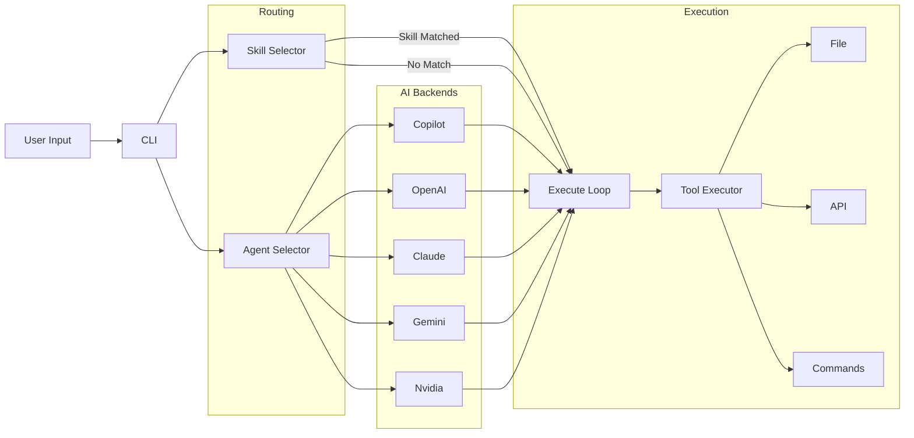

> [!NOTE]
> This README was generated by [SKILL](https://github.com/pardnchiu/skill-readme-generate), get the ZH version from [here](./README.zh.md).


# go-agent-skills

[](https://pkg.go.dev/github.com/pardnchiu/go-agent-skills)
[](https://goreportcard.com/report/github.com/pardnchiu/go-agent-skills)
[](LICENSE)
[](https://github.com/pardnchiu/go-agent-skills/releases)

> A self-directed execution engine driven by Markdown Skill files, with persistent cross-session memory and dual-layer LLM routing to automatically dispatch Skills and Agents

## Table of Contents

- [Features](#features)
- [Architecture](#architecture)
- [File Structure](#file-structure)
- [License](#license)
- [Author](#author)
- [Stars](#stars)

## Features

> `go install github.com/pardnchiu/go-agent-skills/cmd/cli@latest` · [Documentation](./doc.md)

### Skill-as-Prompt: Markdown-Driven LLM Instruction Framework

Skills are plain Markdown files injected directly as structured system prompts into the execution loop. The engine automatically scans multiple paths (project, user home, global mount points), parses frontmatter, and dynamically resolves `scripts/`, `templates/`, and `assets/` references to absolute paths. Extending capabilities requires no source code changes — just place a `SKILL.md` in any scan path and the system picks it up on the next run.

### Persistent Cross-Session Memory with Auto-Summary Compression

Session state is preserved across multiple invocations. After each LLM response, the system automatically extracts a structured summary from the output (via `<!--SUMMARY_START-->` markers or a fallback trailing JSON block pattern), then injects the summary in place of full history on the next call — drastically reducing token consumption. The built-in `search_history` tool lets the LLM actively retrieve its own past decisions during long workflows.

### Dual-Layer LLM Auto-Routing and Safe Tool Executor

Both Skill selection and Agent selection are driven by dedicated lightweight LLM calls, requiring zero user intervention. Tool calls are deduplicated via a content-hash cache to prevent redundant executions. `rm` commands are intercepted and redirected to `.Trash/` instead of permanent deletion, and shell access is strictly gated by a whitelist. Custom API tools load dynamically from JSON config files — no source modification needed.

## Architecture



## File Structure

```
go-agent-skills/
├── cmd/
│   └── cli/
│       └── main.go               # CLI entry point
├── internal/
│   ├── agents/
│   │   ├── exec/                 # Unified execution package
│   │   │   ├── execute.go        # Execution loop
│   │   │   ├── run.go            # Entry point + AgentRegistry
│   │   │   ├── selectAgent.go    # LLM Agent routing
│   │   │   ├── selectSkill.go    # LLM Skill routing
│   │   │   ├── getSession.go     # Session management
│   │   │   ├── extractSummary.go # Auto-summary extraction
│   │   │   ├── writeHistory.go   # History persistence
│   │   │   └── toolCall.go       # Deduplicated tool execution
│   │   └── provider/             # Claude, OpenAI, Copilot, Gemini, Nvidia
│   ├── skill/                    # Skill scanner & parser
│   ├── tools/                    # Tool executor
│   │   ├── apis/                 # Yahoo Finance, Google RSS, Weather
│   │   ├── apiAdapter/           # JSON-driven dynamic API loader
│   │   ├── browser/              # Headless Chrome page fetch
│   │   ├── calculator/           # Math expression evaluator
│   │   └── file/                 # File operation tools (incl. searchHistory)
├── go.mod
└── README.md
```

## License

This project is licensed under the [MIT LICENSE](LICENSE).

## Author


<h4 style="padding-top: 0">邱敬幃 Pardn Chiu</h4>

<a href="mailto:dev@pardn.io" target="_blank">

</a> <a href="https://linkedin.com/in/pardnchiu" target="_blank">

</a>

## Stars

[](https://www.star-history.com/#pardnchiu/go-agent-skills&Date)

***

©️ 2026 [邱敬幃 Pardn Chiu](https://linkedin.com/in/pardnchiu)
