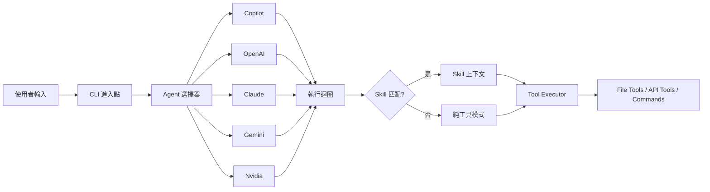

> [!NOTE]
> 此 README 由 [SKILL](https://github.com/pardnchiu/skill-readme-generate) 生成，英文版請參閱 [這裡](./README.md)。


# go-agent-skills

[](https://pkg.go.dev/github.com/pardnchiu/go-agent-skills)
[](https://goreportcard.com/report/github.com/pardnchiu/go-agent-skills)
[](LICENSE)
[](https://github.com/pardnchiu/go-agent-skills/releases)

> 統一多家 AI Agent 介面的 Skill 執行引擎，支援 GitHub Copilot、OpenAI、Claude、Gemini 與 Nvidia

## 目錄

- [功能特點](#功能特點)
- [架構](#架構)
- [檔案結構](#檔案結構)
- [授權](#授權)
- [Author](#author)
- [Stars](#stars)

## 功能特點

> `go install github.com/pardnchiu/go-agent-skills/cmd/cli@latest` · [完整文件](./doc.zh.md)

### 五大 AI 後端統一介面

透過統一的 `Agent` interface 支援 GitHub Copilot（裝置碼認證）、OpenAI、Anthropic Claude、Google Gemini、Nvidia 五種 AI 後端，消除各 API 的差異。切換後端無需修改 Skill 或工具定義，系統自動處理訊息格式轉換與工具呼叫標準化。

### LLM 驅動的 Skill 自動匹配

透過 LLM 分析使用者輸入，從已安裝的 Skill 中自動識別並選擇最適合的執行方案，無需手動指定。若無匹配 Skill，系統自動降級為純工具呼叫模式，最多支援 32 次工具迭代迴圈，確保複雜任務完整完成。

### 安全工具執行器（rm 攔截 + 動態 API 擴展）

內建 `rm` 命令攔截機制將誤刪檔案移至 `.Trash` 保護資料，搭配命令白名單嚴格限制可執行指令範圍。除 14 個內建工具（檔案操作、Yahoo Finance、Google News、天氣查詢、HTTP 請求）外，支援透過 JSON 設定檔動態擴展自訂 API 工具，無需修改原始碼。

## 架構



## 檔案結構

```
go-agent-skills/
├── cmd/
│   └── cli/
│       └── main.go           # CLI 進入點
├── internal/
│   ├── agents/               # Agent 實作
│   │   ├── exec.go          # 統一執行迴圈
│   │   └── provider/        # Claude、OpenAI、Copilot、Gemini、Nvidia
│   ├── skill/                # Skill 掃描器與解析器
│   ├── tools/                # 工具執行器
│   │   ├── apis/            # Yahoo Finance、Google RSS、天氣
│   │   │   └── searchWeb/   # 網路搜尋（Brave + DuckDuckGo）
│   │   ├── apiAdapter/      # JSON 驅動的動態 API 載入器
│   │   ├── browser/         # Chrome 無頭瀏覽器頁面擷取
│   │   ├── calculator/      # 數學表達式計算器
│   │   └── file/            # 檔案操作工具
├── go.mod
└── README.md
```

## 授權

本專案採用 [MIT LICENSE](LICENSE)。

## Author


<h4 style="padding-top: 0">邱敬幃 Pardn Chiu</h4>

<a href="mailto:dev@pardn.io" target="_blank">

</a> <a href="https://linkedin.com/in/pardnchiu" target="_blank">

</a>

## Stars

[](https://www.star-history.com/#pardnchiu/go-agent-skills&Date)

***

©️ 2026 [邱敬幃 Pardn Chiu](https://linkedin.com/in/pardnchiu)
