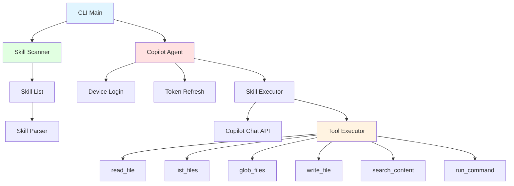

> [!NOTE]
> 此 README 由 [SKILL](https://github.com/pardnchiu/skill-readme-generate) 生成，英文版請參閱 [這裡](./README.md)。

# go-agent-skills

[](https://pkg.go.dev/github.com/pardnchiu/go-agent-skills)
[](https://goreportcard.com/report/github.com/pardnchiu/go-agent-skills)
[](LICENSE)
[](https://github.com/pardnchiu/go-agent-skills/releases)

> 輕量級 Go CLI 工具，透過 GitHub Copilot 認證執行 AI skill 並整合完整的檔案系統工具鏈

## 目錄

- [功能特點](#功能特點)
- [架構](#架構)
- [安裝](#安裝)
- [使用方法](#使用方法)
- [CLI 參考](#cli-參考)
- [API 參考](#api-參考)
- [授權](#授權)
- [Author](#author)
- [Stars](#stars)

## 功能特點

- **GitHub Copilot 認證**：支援裝置碼登入流程與 token 自動刷新機制
- **多目錄 Skill 掃描**：自動掃描 `.claude/skills`、`.skills`、`.opencode/skills`、`.openai/skills`、`.codex/skills` 及 `/mnt/skills/*` 下的所有可用 skill
- **Skill 執行引擎**：透過 Copilot Chat API 執行 skill 並處理最多 128 次工具呼叫循環
- **完整工具系統**：內建 `read_file`、`list_files`、`glob_files`、`write_file`、`search_content`、`run_command` 六種工具
- **安全指令執行**：指令白名單機制、`rm` 自動轉為 `.Trash` 安全刪除、shell 操作符支援
- **目錄排除機制**：自動排除 `.git`、`node_modules`、`vendor`、`dist` 等目錄
- **互動式確認**：工具呼叫前提示使用者確認，支援 `--allow` 旗標跳過確認

### 開發路線圖

**認證機制：**
- [x] 支援 GitHub Copilot 認證
- [ ] 支援 Claude API key 認證
- [ ] 支援 Claude 裝置認證
- [ ] 支援 OpenAI API key 認證
- [ ] 支援 OpenAI 裝置認證

## 架構



## 安裝

### 前置需求

- Go 1.20 或更高版本
- GitHub Copilot 訂閱（用於認證）

### 從原始碼安裝

```bash
git clone https://github.com/pardnchiu/go-agent-skills.git
cd go-agent-skills
go build -o agent-skills cmd/cli/main.go
```

### 使用 go install

```bash
go install github.com/pardnchiu/go-agent-skills/cmd/cli@latest
```

## 使用方法

### 首次認證

第一次執行時，會自動觸發 GitHub Copilot 裝置碼登入流程：

```bash
./agent-skills
```

系統會顯示：
1. 使用者代碼（User Code）
2. 驗證網址（Verification URI）
3. 過期時間

按下 Enter 後會自動開啟瀏覽器，輸入使用者代碼完成認證。Token 儲存於 `~/.config/go-agent-skills/copilot_token.json`。

### 列出所有可用的 Skill

```bash
./agent-skills list
```

輸出範例：

```
Found 3 skill(s):

• commit-generate
  從 git diff 生成單句提交訊息
  Path: /Users/user/.claude/skills/commit-generate

• readme-generate
  從原始碼分析自動生成雙語 README
  Path: /Users/user/.claude/skills/readme-generate

• version-generate
  從最新的 git tag 到 HEAD 生成結構化變更日誌並推薦新版本
  Path: /Users/user/.claude/skills/version-generate
```

### 執行 Skill

```bash
./agent-skills run <skill_name> <input>
```

範例：

```bash
# 互動模式（每次工具呼叫前確認）
./agent-skills run commit-generate "generate commit message from current changes"

# 自動模式（跳過確認）
./agent-skills run readme-generate "generate readme" --allow
```

## CLI 參考

| 指令 | 語法 | 描述 |
|------|------|------|
| `list` | `./agent-skills list` | 列出所有已安裝的 skill |
| `run` | `./agent-skills run <skill> <input> [--allow]` | 執行指定的 skill |

### 旗標

| 旗標 | 描述 |
|------|------|
| `--allow` | 跳過工具呼叫的互動式確認提示 |

### 環境變數

| 變數 | 預設值 | 描述 |
|------|--------|------|
| `HOME` | - | 用於定位 token 儲存路徑 `~/.config/go-agent-skills/` |

### 內建工具

| 工具 | 參數 | 描述 |
|------|------|------|
| `read_file` | `path` | 讀取指定檔案內容 |
| `list_files` | `path`, `recursive` | 列出目錄內容，支援遞迴模式 |
| `glob_files` | `pattern` | 依 glob 模式尋找檔案（如 `**/*.go`） |
| `write_file` | `path`, `content` | 寫入或建立檔案 |
| `search_content` | `pattern`, `file_pattern` | 以正規表示式搜尋檔案內容 |
| `run_command` | `command` | 執行白名單內的 shell 指令 |

### 允許的指令

| 類別 | 指令 |
|------|------|
| 版本控制 | `git` |
| 程式語言與套件管理 | `go`, `node`, `npm`, `yarn`, `pnpm`, `python`, `python3`, `pip`, `pip3` |
| 檔案操作 | `ls`, `cat`, `head`, `tail`, `pwd`, `mkdir`, `touch`, `cp`, `mv`, `rm`* |
| 文字處理 | `grep`, `sed`, `awk`, `sort`, `uniq`, `diff`, `cut`, `tr`, `wc` |
| 搜尋 | `find` |
| 資料格式 | `jq` |
| 系統資訊 | `echo`, `which`, `date` |

> \* `rm` 指令會自動將檔案移至 `.Trash` 目錄而非真正刪除

## API 參考

### Client Package (`internal/client`)

#### `NewCopilot() (*CopilotAgent, error)`

建立新的 Copilot 客戶端實例。自動載入已儲存的 token，若不存在則觸發裝置碼登入流程。

#### `(*CopilotAgent) Execute(ctx context.Context, skill *skill.Skill, userInput string, output io.Writer, allowAll bool) error`

執行指定的 skill。進入工具呼叫循環（最多 128 次迭代），每次迭代處理 API 回應中的工具呼叫請求。

**參數：**
- `ctx`：Context 實例
- `skill`：要執行的 Skill 實例
- `userInput`：使用者輸入的指令或提示
- `output`：輸出寫入器（通常為 `os.Stdout`）
- `allowAll`：設為 `true` 時跳過工具呼叫確認提示

#### `(*CopilotAgent) Login(ctx context.Context) (*CopilotToken, error)`

執行 GitHub Copilot 裝置碼登入流程。顯示驗證網址與使用者代碼，自動開啟瀏覽器，輪詢直到使用者完成授權或裝置碼過期。

### Skill Package (`internal/skill`)

#### `NewScanner() *Scanner`

建立新的 Skill 掃描器實例並立即執行掃描。以 Goroutine 併發掃描所有設定的路徑。

#### `(*Scanner) List() []string`

取得所有已掃描的 skill 名稱列表。

### Tools Package (`internal/tools`)

#### `NewExecutor(workPath string) (*Executor, error)`

建立新的工具執行器。從 embedded `tools.json` 載入工具定義，初始化指令白名單與目錄排除列表。

#### `(*Executor) Execute(name string, args json.RawMessage) (string, error)`

依工具名稱分派執行對應的工具函式。

**支援的工具：** `read_file`、`list_files`、`glob_files`、`write_file`、`search_content`、`run_command`

### 資料結構

#### `CopilotToken`

```go
type CopilotToken struct {
    AccessToken string    `json:"access_token"`
    TokenType   string    `json:"token_type"`
    Scope       string    `json:"scope"`
    ExpiresAt   time.Time `json:"expires_at"`
}
```

#### `Skill`

```go
type Skill struct {
    Name        string // skill 名稱
    Description string // skill 描述（從 SKILL.md frontmatter 解析）
    AbsPath     string // 絕對路徑
    Path        string // skill 資料夾路徑
    Content     string // 完整檔案內容
    Body        string // frontmatter 之後的主體內容
    Hash        string // SHA-256 內容雜湊值
}
```

#### `SkillList`

```go
type SkillList struct {
    ByName map[string]*Skill // 以名稱索引的 skill
    ByPath map[string]*Skill // 以路徑索引的 skill
    Paths  []string          // 掃描的路徑列表
}
```

#### `Executor`

```go
type Executor struct {
    WorkPath       string          // 工作目錄
    Allowed        []string        // 允許操作的資料夾
    AllowedCommand map[string]bool // 允許執行的指令白名單
    Exclude        []string        // 排除的目錄名稱
    Tools          []Tool          // 工具定義列表
}
```

#### `Tool`

```go
type Tool struct {
    Type     string       `json:"type"`
    Function ToolFunction `json:"function"`
}

type ToolFunction struct {
    Name        string          `json:"name"`
    Description string          `json:"description"`
    Parameters  json.RawMessage `json:"parameters"`
}
```

## 授權

本專案採用 [MIT LICENSE](LICENSE)。

## Author


<h4 style="padding-top: 0">邱敬幃 Pardn Chiu</h4>

<a href="mailto:dev@pardn.io" target="_blank">

</a> <a href="https://linkedin.com/in/pardnchiu" target="_blank">

</a>

## Stars

[](https://www.star-history.com/#pardnchiu/go-agent-skills&Date)

***

©️ 2026 [邱敬幃 Pardn Chiu](https://linkedin.com/in/pardnchiu)
