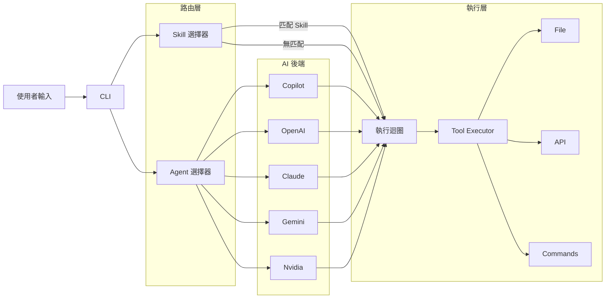

> [!NOTE]
> 此 README 由 [SKILL](https://github.com/pardnchiu/skill-readme-generate) 生成，英文版請參閱 [這裡](./README.md)。


# go-agent-skills

[](https://pkg.go.dev/github.com/pardnchiu/go-agent-skills)
[](https://goreportcard.com/report/github.com/pardnchiu/go-agent-skills)
[](LICENSE)
[](https://github.com/pardnchiu/go-agent-skills/releases)

> 以 Markdown Skill 檔案驅動 LLM 的自律執行引擎，跨對話保持記憶，並透過雙層 LLM 路由自動調度 Skill 與 Agent

## 目錄

- [功能特點](#功能特點)
- [架構](#架構)
- [檔案結構](#檔案結構)
- [授權](#授權)
- [Author](#author)
- [Stars](#stars)

## 功能特點

> `go install github.com/pardnchiu/go-agent-skills/cmd/cli@latest` · [完整文件](./doc.zh.md)

### Skill-as-Prompt：Markdown 驅動的 LLM 指令框架

Skill 是純 Markdown 檔案，直接作為 LLM 的結構化系統提示詞注入執行迴圈。引擎自動掃描多個路徑（專案、使用者家目錄、全域掛載點），解析 frontmatter 後動態替換 `scripts/`、`templates/`、`assets/` 為絕對路徑。擴充能力無需修改任何原始碼，只需在掃描路徑下建立 `SKILL.md`，系統下次啟動即自動識別。

### 跨對話持久記憶與自動摘要壓縮

Session 狀態在多次呼叫之間持續保存。每次 LLM 回應完成後，系統自動從輸出中提取結構化摘要（透過 `<!--SUMMARY_START-->` 標記或尾段 JSON 區塊的 fallback 解析），並以摘要取代完整歷史注入下一次對話，大幅壓縮 token 消耗。同時內建 `search_history` 工具，讓 LLM 在長流程中主動搜尋自己的決策歷史。

### 雙層 LLM 自動路由與安全工具執行器

Skill 選擇與 Agent 選擇均由獨立的輕量 LLM 呼叫自動完成，無需使用者介入。工具呼叫透過內容雜湊去重快取避免重複執行，`rm` 指令自動攔截並移至 `.Trash/` 而非永久刪除，shell 執行受白名單嚴格限制。自訂 API 工具透過 JSON 設定檔動態載入，無需修改原始碼。

## 架構



## 檔案結構

```
go-agent-skills/
├── cmd/
│   └── cli/
│       └── main.go               # CLI 進入點
├── internal/
│   ├── agents/
│   │   ├── exec/                 # 統一執行套件
│   │   │   ├── execute.go        # 執行迴圈
│   │   │   ├── run.go            # 入口 + AgentRegistry
│   │   │   ├── selectAgent.go    # LLM Agent 路由
│   │   │   ├── selectSkill.go    # LLM Skill 路由
│   │   │   ├── getSession.go     # Session 管理
│   │   │   ├── extractSummary.go # 自動摘要提取
│   │   │   ├── writeHistory.go   # 歷史持久化
│   │   │   └── toolCall.go       # 工具呼叫去重執行
│   │   └── provider/             # Claude、OpenAI、Copilot、Gemini、Nvidia
│   ├── skill/                    # Skill 掃描器與解析器
│   ├── tools/                    # 工具執行器
│   │   ├── apis/                 # Yahoo Finance、Google RSS、天氣
│   │   ├── apiAdapter/           # JSON 驅動的動態 API 載入器
│   │   ├── browser/              # Chrome 無頭瀏覽器頁面擷取
│   │   ├── calculator/           # 數學表達式計算器
│   │   └── file/                 # 檔案操作工具（含 searchHistory）
├── go.mod
└── README.md
```

## 授權

本專案採用 [MIT LICENSE](LICENSE)。

## Author


<h4 style="padding-top: 0">邱敬幃 Pardn Chiu</h4>

<a href="mailto:dev@pardn.io" target="_blank">

</a> <a href="https://linkedin.com/in/pardnchiu" target="_blank">

</a>

## Stars

[](https://www.star-history.com/#pardnchiu/go-agent-skills&Date)

***

©️ 2026 [邱敬幃 Pardn Chiu](https://linkedin.com/in/pardnchiu)
